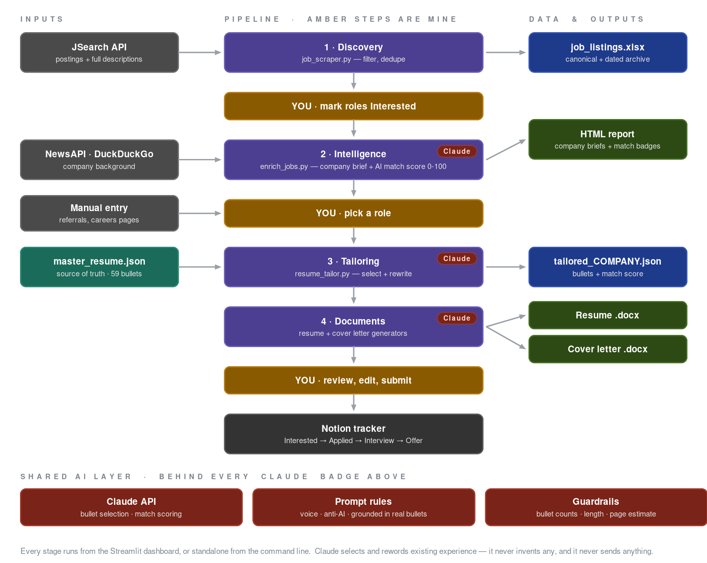
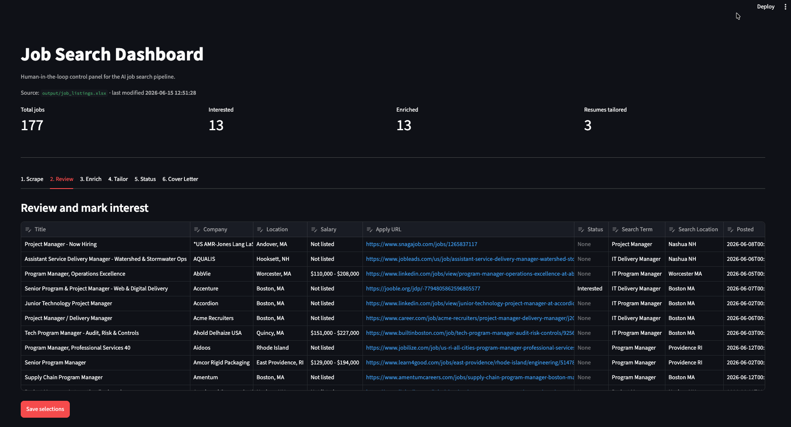

# AI Job Search System

**An AI-powered job search pipeline that finds roles, researches the companies, and tailors a resume and cover letter for each one.**

Built by Jason Darrow · [jasondarrow.com](https://jasondarrow.com) · [LinkedIn](https://linkedin.com/in/jason-w-darrow)

---

## Why I built this

I was laid off in June 2026 after 10+ years in IT delivery.  I needed a job, and I
needed to learn AI engineering.  This project is both.

The job search itself is the problem I solved.  Tailoring a resume to each posting
is the single highest-leverage thing you can do in a search, and it is also the
thing people skip, because doing it well takes an hour per role.  So I built a
system that does the mechanical part and leaves the judgment to me.

Everything here is running code that I use on real applications.  It is not a
demo.  The resumes it produces are the resumes I send.

---

## How it works

The pipeline runs in four stages, with three points where I take over.



The whole thing runs from a Streamlit dashboard, or stage by stage from the
command line.

**The three marked steps are mine.**  That is the design, not a limitation.
Claude selects and rewords experience that already exists in the master resume.
It never invents any, and it never sends anything.



*The Review tab.  177 roles scraped, 13 marked Interested, 3 resumes tailored.
Every stage of the pipeline runs from a tab in this panel, with the script output
streamed live into the page.*

---

## What it does

- **Scrapes job boards** across multiple titles and locations via the JSearch API
  (OpenWeb Ninja).  Captures the full job description for every posting, filters
  by salary floor, age, job type, and a title allowlist, and dedupes on
  (Company, Title).
- **Enriches listings** with company intelligence: industry, size, stability,
  growth trend, and recent news via DuckDuckGo search and NewsAPI.  Adds an AI
  **resume match score** (0-100) with notes, comparing the full posting against
  the master resume.
- **Generates an HTML report** of shortlisted roles with company briefs,
  color-coded match badges, and ready-to-run tailor commands.
- **Tailors resumes** with the Claude API.  Claude reads the posting, picks the
  strongest matching bullets from a 59-bullet master resume database, and
  rewrites the summary for the role.
- **Generates Word documents** by injecting the tailored content into a
  professionally formatted template, so every output inherits the same layout.
- **Generates cover letters** grounded in the same bullets chosen for the resume,
  written against explicit voice rules so they do not read like AI output.
- **Runs from a Streamlit dashboard** so the whole pipeline works from a browser,
  with live script output streamed into the page.

---

## Quick start

```bash
git clone https://github.com/darrowj/ai-job-search.git
cd ai-job-search
pip3 install -r requirements.txt
```

Create a `.env` file in the project root:

```
ANTHROPIC_API_KEY=your_key
JSEARCH_API_KEY=your_key
NEWS_API_KEY=your_key
MIN_SALARY=160000
```

Edit `search_config.json` to set your titles, locations, and filters.  Every
option is documented inline with `_comment` fields.

Then launch the dashboard:

```bash
streamlit run dashboard.py
```

---

## The dashboard

`dashboard.py` is the human-in-the-loop control panel.  Every button runs the
same script you would run from a terminal, with stdout streamed live into the
page so you can watch the work happen.

| Tab | What it does |
|-----|---------------|
| 1. Scrape | Runs `job_scraper.py`.  Writes the canonical Excel plus a dated archive snapshot. |
| 2. Review | Edit the `Status` column in place (`Interested` / `Skip`) and save back to Excel. |
| 3. Enrich | Runs `enrich_jobs.py` for Interested roles, renders company briefs, generates the HTML report. |
| 4. Tailor | Tailors a resume for one role, from **either** an Interested row **or** a hand-entered role found outside the pipeline.  Generates the resume `.docx` and cover letter. |
| 5. Status | Read-only tracker: enrichment, tailored JSON, resume, cover letter, and match score per role. |
| 6. Cover Letter | Standalone cover letter generation for any role, with or without a tailored resume. |

**Tab 4 has two modes.**  Most roles come from the scraper, but the best ones
often come from a referral or a company careers page.  Manual entry takes a
company, title, and pasted description, runs the identical pipeline, and
optionally writes the role into the tracker so it appears in Tab 5 alongside
scraped roles.

---

## Command line

The dashboard is a wrapper.  Every stage runs standalone:

```bash
# 1. Search
python3 job_scraper.py
#    → output/job_listings.xlsx  (+ dated snapshot in output/archive/)

# 2. Mark roles "Interested" in the Excel, then enrich
python3 enrich_jobs.py
python3 report_generator.py
#    → output/job_report_YYYY-MM-DD.html

# 3. Tailor for one role
python3 resume_tailor.py --company "Fidelity" \
                         --title "Technical Project Delivery Manager" \
                         --description "<paste full JD>"
#    → output/tailored_Fidelity.json

# 4. Build the documents
python3 resume_generator.py --input output/tailored_Fidelity.json
python3 cover_letter_generator.py --company "Fidelity" \
                                  --title "Technical Project Delivery Manager" \
                                  --description "<paste full JD>"
#    → personal/Jason_Darrow_Resume_Fidelity.docx
#    → personal/CoverLetter_Fidelity.docx
```

---

## Design decisions

**Master resume as a database.**  Instead of one static resume, every piece of
career experience lives in `master_resume.json` as one of 59 bullets, tagged by
skill category and scored 1-10 for strength.  Claude selects the best handful per
role instead of showing everything.  This is what makes real tailoring possible
at speed.

**Template injection instead of document generation.**  `resume_generator.py`
opens a professionally formatted Word document and replaces only the summary and
the bullets.  Margins, fonts, spacing, and section styling are inherited
untouched.  Building a resume from scratch with python-docx produces something
that looks built from scratch.

**Guardrails on model output.**  A prompt is a request, not a constraint.  One
run returned 8 bullets when the prompt asked for 5, which silently pushed the
resume to three pages.  Two checks now catch that:
- `resume_tailor.py` validates the response after parsing.  It trims bullet
  overruns and reports summaries or bullets that exceed the length budget.
- `resume_generator.py` estimates the rendered page count and warns when output
  will run long.  The estimate uses wrapped line counts calibrated against real
  rendered output (accurate within one line) rather than converting to PDF, so
  no one has to install LibreOffice to get a warning.

Neither one blocks generation.  They make a bad result impossible to miss.

**Match scoring before tailoring.**  `enrich_jobs.py` scores each posting against
the master resume and writes the score to the Excel.  Tailoring costs an API call
and my attention, so I want to know which roles are worth it first.

**Full job descriptions captured at scrape time.**  The scraper stores each
posting's complete text, so tailoring pulls the description straight from the
spreadsheet.  Manual paste is the fallback, not the default.

**Allowlist filtering, not blocklist.**  Rather than maintaining a growing list
of titles to exclude, the scraper uses a `require_title_keywords` allowlist.
Anything that does not match is dropped.  No whack-a-mole.

**Config in Git, secrets in .env.**  Search preferences are committed and
documented so the repo is reproducible.  The salary floor lives in `.env` with
the API keys, because publishing your number weakens your negotiating position.

**Human in the loop, on purpose.**  Claude selects and rewords existing
experience.  It never invents any.  Every resume is reviewed and edited before it
goes out.  A job search is exactly the wrong place to trust unverified AI output.

---

## Tech stack

| Tool | Purpose |
|------|---------|
| Python 3 | Core language |
| Claude API (Anthropic) | Resume tailoring, cover letters, match scoring |
| JSearch API (OpenWeb Ninja) | Job search and full job descriptions |
| NewsAPI | Recent company news |
| ddgs (DuckDuckGo) | Company background search |
| python-docx | Word document generation |
| pandas + openpyxl | Excel data handling |
| Streamlit | Dashboard control panel |
| python-dotenv | Secrets management |
| AWS S3 + Route 53 | Portfolio site hosting |

---

## Project files

```
dashboard.py                Streamlit control panel for the whole pipeline
job_scraper.py              JSearch API search, filtering, dedupe, Excel output
search_config.json          Search preferences, documented inline (committed)
enrich_jobs.py              Company intel + AI resume match scoring
report_generator.py         HTML report with company briefs and match badges
resume_tailor.py            Claude bullet selection + output validation
resume_generator.py         Word doc via template injection + length check
cover_letter_generator.py   Voice-matched cover letter generation
master_resume.json          59-bullet career database, tagged and strength-scored
index.html                  Portfolio site source
.env                        API keys + salary floor (never committed)
```

---

## Status

| Wave | Description | Status |
|------|-------------|--------|
| 0 | Master resume JSON database | Complete |
| 1 | Job scraper with config-driven filters | Complete |
| 2 | AI resume tailoring + Word generation | Complete |
| 2.5 | Company intelligence enrichment | Complete |
| 3 | HTML job report | Complete |
| 4 | Portfolio site | Complete |
| 5 | Streamlit dashboard | Complete |
| 6 | AI cover letter generation | Complete |
| 7 | Off-pipeline roles + output guardrails | Complete |

---

## About

Built by **Jason W. Darrow** — IT Delivery Manager, US Air Force veteran, BJJ
black belt.  10+ years leading IT programs in financial services, currently
learning AI by building with it.

- [jasondarrow.com](https://jasondarrow.com)
- [linkedin.com/in/jason-w-darrow](https://linkedin.com/in/jason-w-darrow)
- [github.com/darrowj](https://github.com/darrowj)
